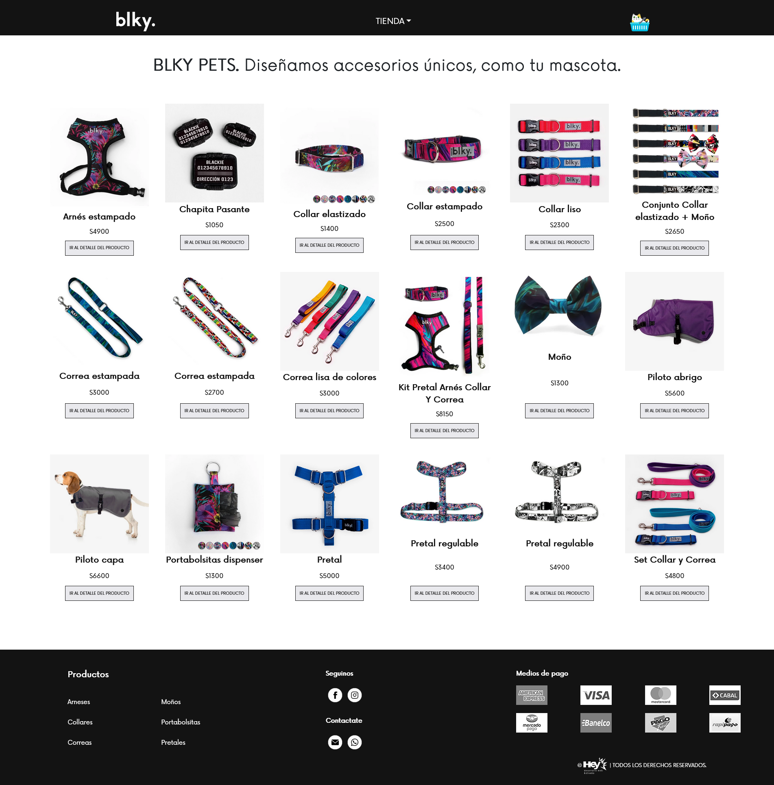
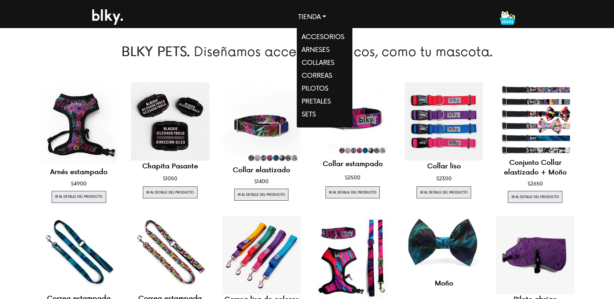
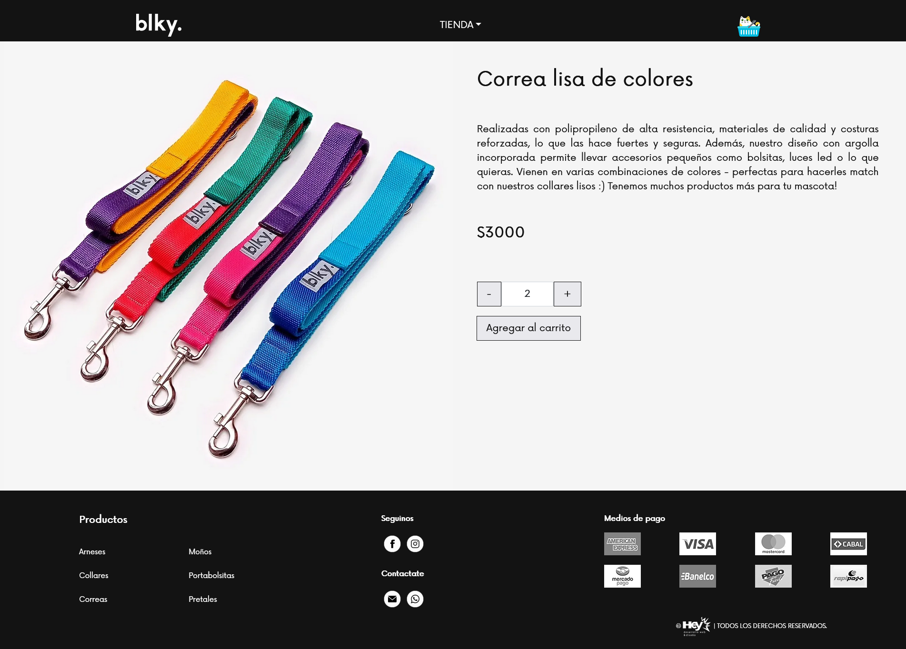
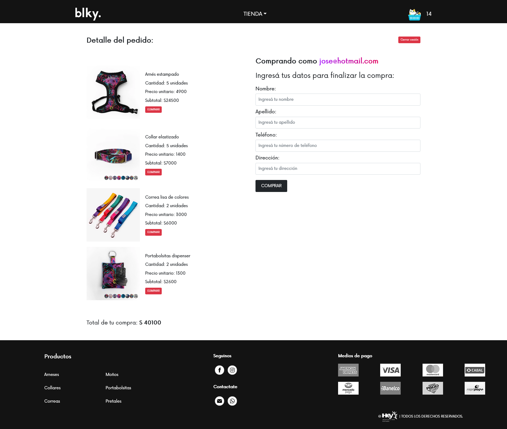
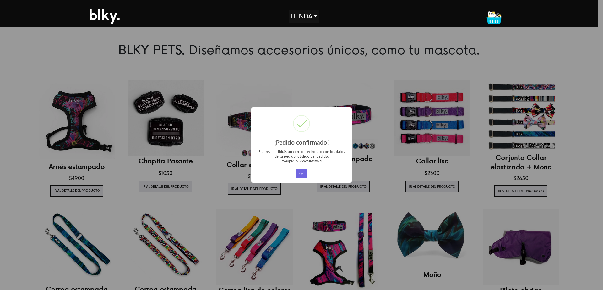

## Alumno:  
[Estanislao Elías Varela Lucius](https://github.com/EstanisEVL/)

# BLKY Pets - Proyecto para el curso de React JS de la carrera de Desarrollo Frontend React de CoderHouse
**Versión 1.0**

Mi proyecto final, BLKY Pets, es un sitio web diseñado para la venta de accesorios para mascotas en formato e-commerce. La aplicación permite que el usuario:
- Visualice el catálogo completo de productos disponibles.
- Filtre por categorías utilizando el menú desplegable.
- Ingrese al detalle de cada producto.
- Elija la cantidad y luego agregue cada producto al carrito[^1].
- Ingrese al carrito para ver un desglose de la compra.
- Se registre o inicie sesión dependiendo de si ya está logueado o no.
- Complete sus datos de compra.
- Y genere la orden de compra al confirmar sus datos, recibiendo el id de la orden al finalizar.

[^1]: Los productos ingresados al carrito se guardan en el localStorage para evitar que se borren los datos al recargar el sitio.

Landing page:

Categorías dinámicas:

Detalle del producto:

Carrito:

Generación de orden de compra:

---

## Demo

Para probar mi sitio ingresá al siguiente [link](https://blkypetsreact.netlify.app/).

---

## Proceso de desarrollo:
A partir del *Workbook* y la *Hoja de ruta* fui desarrollando el proyecto de la siguiente manera:

1. **Estructuración base del proyecto**: creé el proyecto en React desde la terminal de VSC utilizando el comando `npx create-react-app`. Luego limpié las carpetas creadas por defecto, removiendo los archivos innecesarios. Finalmente creé el componente *NavBar* en la carpeta *components*, cuya funcionalidad es la de renderizar la barra de navegación que incluye el logo del e-commerce y un listado de categorías clickeables.
Además creé el componente *CartWidget* cuya función es la de renderizar el ícono del carrito, y lo ubiqué dentro del componente *NavBar* para que esté visible en todo momento.
Finalmente creé el componente contenedor *ItemListContainer*, el cual recibe una prop greeting y muestra el mensaje dentro del contenedor.
2. **Contador con botón**: Creé el componente *ItemQuantitySelector*, compuesto de un botón y controles, para incrementar y decrementar la cantidad requerida de productos.
3. **Catálogo con map y promises**: Desarrollé los componentes *Item* e *ItemList*, los cuales se encargan de renderizar los productos en el *ItemListContainer*. Implementé un async mock para emular retrasos de red.
4. **Detalle del producto**: Creé el componente *ItemDetailContainer* siguiendo la misma premisa que para el *ItemListContainer*,en el cual también se emulan retrasos de red a través de un async mock, y el componente *ItemDetail* para mostrar la vista del detalle del producto: su foto, descripción y precio.
5. **Sincronizar Counter**: Incorporé el componente *ItemQuantitySelector* en el *ItemDetail*, y configuré el evento de compra correspondiente.
6. **Cart Context**: Implementé un contexto a través de los componentes *Context* y *CartContext* con el fin de mantener el estado de compra del usuario.
7. **Cart View**: Expandí el componente *Cart* incluyéndo el desglose de la compra dentro de el y actualicé el componente *CartWidget* para que indique la cantidad de productos que se encuentran dentro del carrito.
8. **Item Collection**: Configuré el servicio de Firestore provisto por Firebase para crear colecciones de *items*, *categories* y *orders*. Luego las conecté a los componentes *ItemListContainer* y *ItemDetailContainer*. Creé el componente *NavBarCategories* para traer de forma dinámica las categorías de la colección de Firestore. Finalmente implementé los componentes Checkout, CheckoutForm y Login para utilizar el sistema de autenticación de Firebase, y para que el usuario pueda generar la respectiva orden de compra.

---

## Tecnologías y herramientas utilizadas:

       

### Librerías y dependencias implementadas:

`sass v1.54.9` - [react sass](https://create-react-app.dev/docs/adding-a-sass-stylesheet/)
Instalé la dependencia SASS para preprocesar CSS con el fin de mantener organizados todos los estilos de los distintos componentes en sus respectivos archivos y carpetas dentro de la carpeta *styles*.

`react-bootstrap v.2.5.0` - [react-bootstrap](https://react-bootstrap.github.io/)
Añadí react bootstrap para importar botones y estructurar visualmente el contenido del sitio con su sistema de grillas (Containers, Filas y Columnas).

`react-spinners v.0.13.6` - [react-spinners npm](https://www.npmjs.com/package/react-spinners)
Para agregar un elemento visual que le indique al usuario que el sitio está cargando ciertos elementos, instalé la dependencia react-spinners, la cual provee una colección de spinners de carga con React.js.

`sweetalert2 v.11.6.2` - [sweetalert2](https://github.com/sweetalert2/sweetalert2-react-content)
Con el fin de mejorar la experiencia de usuario estilizando las alertas instalé la dependencia SweetAlert2.

`luxon v.3.0.4` - [luxon](https://moment.github.io/luxon/#/?id=luxon)
Instalé la dependencia Luxon para darle formato a la fecha que se le asigna a cada orden que el usuario genera cuando realiza un pedido a través de la aplicación.

---

### CoderHouse
Proyecto desarrollado en base a los conocimientos adquiridos en [CoderHouse](https://www.coderhouse.com/).